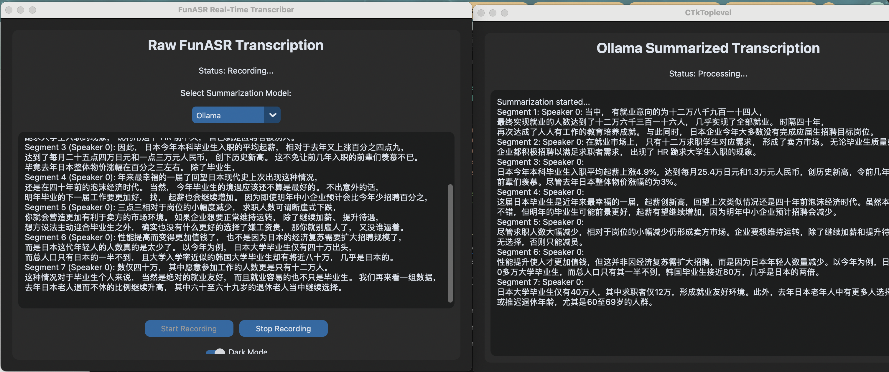

# 🎙️ Offline Voice Recorder & Transcriber (macOS)  
# 🎙️ 离线录音与转写工具（macOS）

A high-performance, privacy-focused offline voice recorder and transcription tool built for macOS.  
一个高性能、注重隐私的离线录音与转写工具，专为 macOS 打造。

It uses [FunASR](https://github.com/alibaba-damo-academy/FunASR) for local speech recognition, and supports both [Ollama](https://ollama.com) and [LM Studio](https://lmstudio.ai) as local LLM backends.  
本工具使用 [FunASR](https://github.com/alibaba-damo-academy/FunASR) 实现本地语音识别，并支持 [Ollama](https://ollama.com) 和 [LM Studio](https://lmstudio.ai) 作为本地大语言模型后端。

---

## 🚀 Features / 功能亮点

- 🎧 **Real-Time Recording**  
  Capture high-quality audio with low latency.  
  实时录音，低延迟高质量音频采集。

- ⚡ **Optimized for macOS**  
  Utilizes macOS hardware acceleration.  
  利用 macOS 原生硬件加速，运行高效。

- 🧠 **Offline ASR with FunASR**  
  Transcribe audio to text fully offline.  
  使用 FunASR 实现本地语音转文字，无需联网。

- 💬 **LLM Post-Processing**  
  Summarize, tag, or interact with transcriptions using local LLMs.  
  可使用本地大模型对转写文本进行总结、关键词提取或问答处理。

- 🔒 **Privacy-First**  
  All operations are done locally — nothing sent to the cloud.  
  全部操作在本地完成，数据不上传云端，确保隐私安全。

- 🔄 **Switchable LLM Backend**  
  Easily switch between Ollama and LM Studio via config.  
  可通过配置文件自由切换 Ollama 和 LM Studio。

---

## 🛠️ Requirements / 系统要求

- macOS 12.0 or later  
  macOS 12 或更高版本

- Python 3.9+  
  Python 3.9 及以上

- [FunASR](https://github.com/alibaba-damo-academy/FunASR) installed  
  已安装 FunASR

- At least one local LLM backend:  
  至少安装一个本地大语言模型平台：
  - [Ollama](https://ollama.com)
  - [LM Studio](https://lmstudio.ai)

---

## 📦 Installation / 安装步骤

```bash
git clone https://github.com/donxing/offline-mac-recorder
cd offline-mac-recorder
pip install -r requirements.txt
python download_model.py
python realtime_transcriber_llm.py
